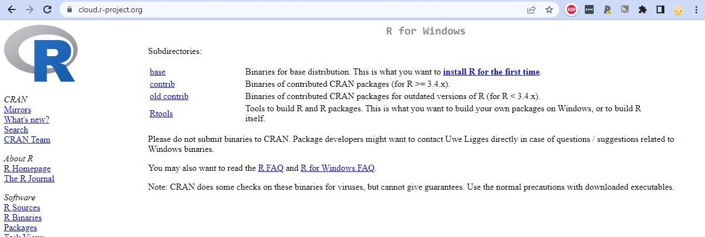
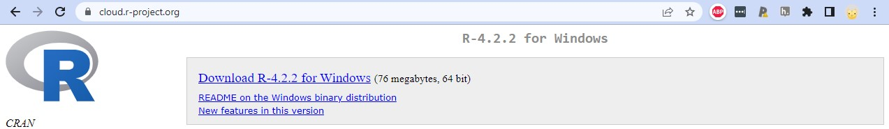
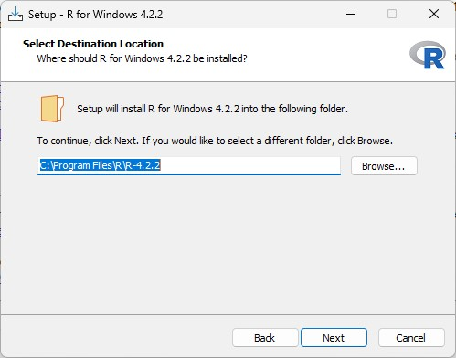

# Onboarding

The lab uses a number of tools.
This section describes them.

## Asana {-}

## Discord

## DataCamp

## Google Calendar

## GitHub

## RStudio

### On the web

## Connect RStudio to Git/GitHub

[HappyGit and GitHub for the useR](https://happygitwithr.com/index.html) is the BEST instruction manual with ALL of the nitty gritty details! However I am going to provide a short version with some more screenshots here.

The general steps are:
- download R
- download RStudio
- download Git
- connect RStudio and Git/GitHub

## Mac

### Download R

```{r, out.width="100%", echo=FALSE}
knitr::include_graphics("imgs/R-RStudio-install.png")
```

### Download R Studio

### Download Git

## Windows

### Download R

Go to https://posit.co/download/rstudio-desktop/

Click the button for `DOWNLOAD AND INSTALL R`

This should take you to https://cloud.r-project.org/

Click on the link `Download R for Windows`

```{r, out.width="100%", echo=FALSE}

```

Click on the link `install R for the first time`

```{r, out.width="100%", echo=FALSE}
knitr::include_graphics("imgs/R-RStudio-install.png")
```

Click on the link `Download R-4.2.3 for Windows` (or whatever is the most recent version of R listed)

```{r, out.width="100%", echo=FALSE}

```

Then open the downloaded .exe file to install

```{r, out.width="100%", echo=FALSE}
knitr::include_graphics("imgs/InstallVerR.jpg")
```

Choose `Next` to install into the default folder

```{r, out.width="100%", echo=FALSE}

```

### Download R Studio

Go to https://posit.co/download/rstudio-desktop/

Click the button for `DOWNLOAD RSTUDIO DESKTOP FOR WINDOWS`
(I think this button changes based upon the computer you are on - check on Mac)


Click on the downloaded .exe file to begin installing RStudio

(I don't have screenshots of this process for windows)

### Download Git

There are 15 different screens during the installation process for Windows. 

### Connect RStudio and GitHub

### Specific to repository: https://github.com/gilmore-lab/protocols

#### Install required Packages for this repository by running

```
install.packages(c("rmarkdown", "knitr", "bookdown", "downlit", "xml2"))
```
