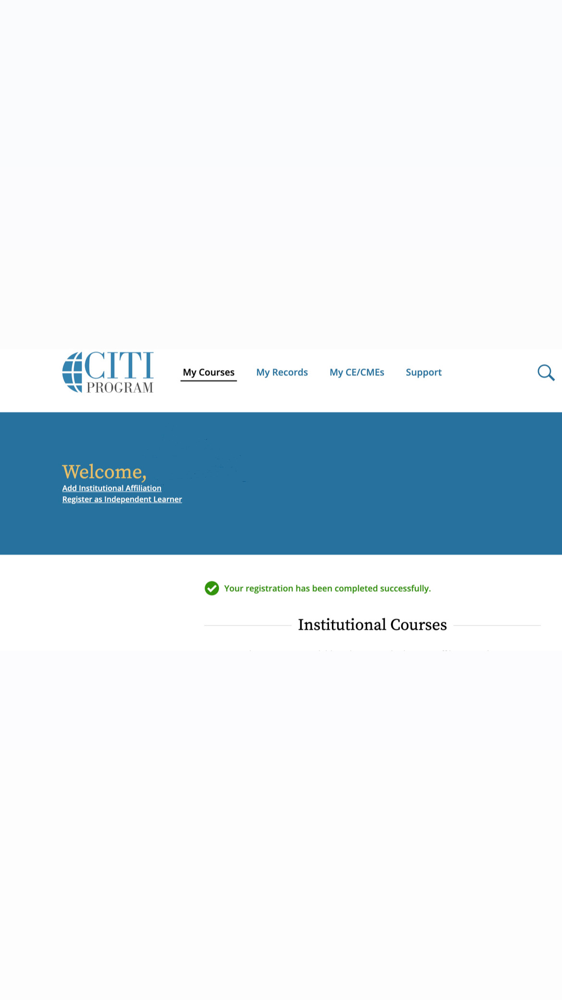
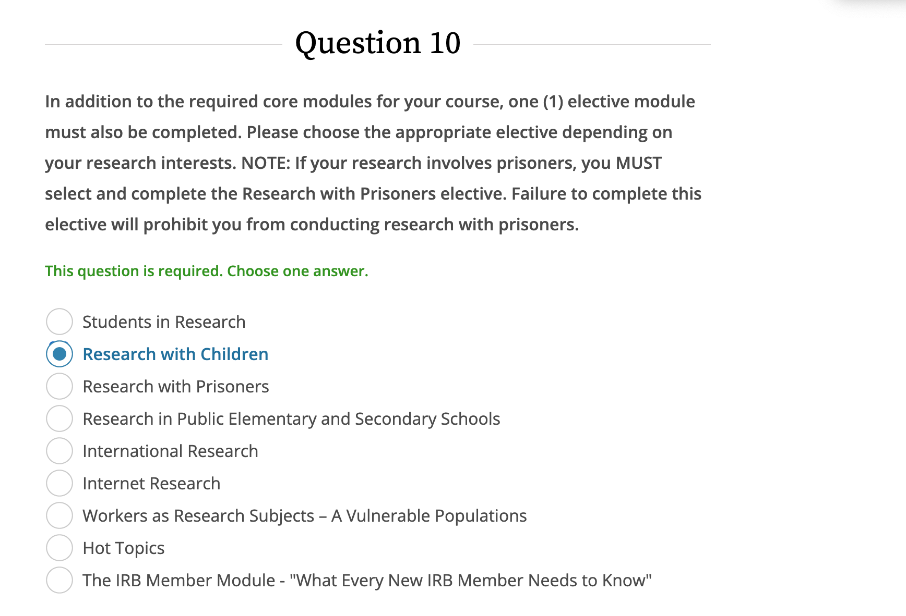
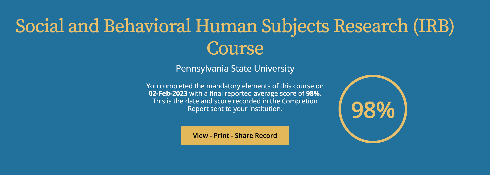
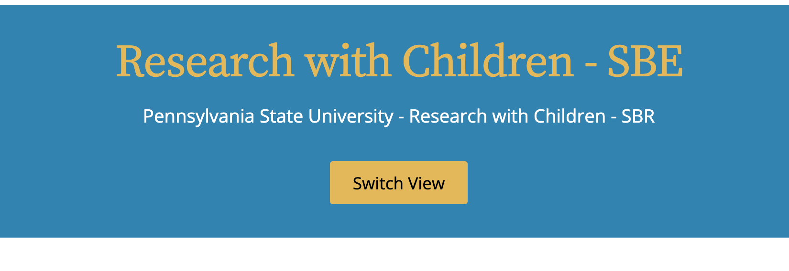
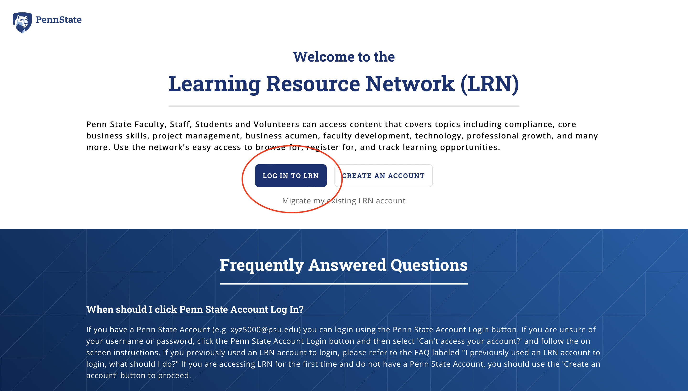
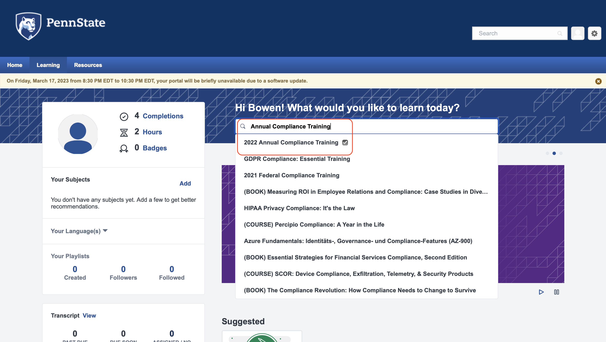

# Trainings

## IRB training {-}

At Penn State, research is governed by an [Institutional Review Board (IRB)](https://www.research.psu.edu/irb).

All faculty, staff, and students who conduct research need to undergo training from the IRB.
There are different training programs for different types of research, e.g., research with human participants or with non-human animals.

In this lab, all students and staff must complete training in the ethics of conducting research with human participants.

### CITI Training {-}

The [Collaborative Institutional Training Initiative (CITI Program)](https://about.citiprogram.org). provides training modules for researchers.

For Access, go to [CITI training](http://citi.psu.edu/).

Expiration: every 3 years.

```{r, echo=FALSE, out.width="100%", fig.align="center"}
knitr::include_graphics("imgs/citi_01.PNG")
```

```{r, echo=FALSE, out.width="100%", fig.align="center"}
knitr::include_graphics("imgs/citi_02.PNG")
```

```{r, echo=FALSE, out.width="100%", fig.align="center"}

```

```{r, echo=FALSE, out.width="100%", fig.align="center"}
knitr::include_graphics("imgs/citi_04.PNG")
```

```{r, echo=FALSE, out.width="100%", fig.align="center"}
knitr::include_graphics("imgs/citi_05.jpg")
```

```{r, echo=FALSE, out.width="100%", fig.align="center"}
knitr::include_graphics("imgs/citi_06.jpg")
```

```{r, echo=FALSE, out.width="100%", fig.align="center"}

```

```{r, echo=FALSE, out.width="100%", fig.align="center"}
knitr::include_graphics("imgs/citi_09.PNG")
```

```{r, echo=FALSE, out.width="100%", fig.align="center"}

```

```{r, echo=FALSE, out.width="100%", fig.align="center"}

```

```{r, echo=FALSE, out.width="100%", fig.align="center"}

```


- Choose the `University Park, Commonwealth, and other non-Hershey personnel` option  
- Click `LOG IN TO CITI`  

Login = PSU Access ID  

Click `View Courses` next to **Pennsylvania State University**  

#### If you have never taken an IRB course before {-}

- Under the **Learner Tools for Pennsylvania State University** click `Add a course`  
- Choose `Institutional Review Board (IRB) training for human subjects research` then `Next`  
- Choose `NO, I have Not completed the Human Subjects Research (IRB) Course through CITI. I need to complete the Human Subjects Research (IRB) Course` then `Next`  
- Choose `Social Science Research` then `Next`  
- Choose `Research with Children` then `Next`  

Take the 'Social and Behavioral Human Subjects Research (IRB) Course'.  

Email your training certificate to the [lab email](mailto:psubrainlab@gmail.com) once this is complete.  

If you have completed this training previously, please email your training certificate.  

#### If you are taking a renewal IRB course {-}

## Other PSU-required trainings {-}

### Annual Compliance Training {-}

The Penn State compliance training is required for all Penn State employees, graduate students, and students participating in research at Penn State. This training covers ethics and obligation required of a Penn State employee.

To learn more about the compliance training or other trainings at Penn State please visit either of the following links: 

https://universityethics.psu.edu/resources-and-training

https://universityethics.psu.edu/resources-and-training/compliance-training-plan

The compliance training has a required renewal of 365 days.

For Access go to the [Learning Resource Network](http://lrn.psu.edu/)  

### Understanding Title IX at Penn State

Employees and anyone with an active Penn State Access Account (WebAccess) should access the training through the [Learning Resource Network](http://lrn.psu.edu/): 

- Click the box `Faculty, Staff & Part time`
- Then `Login with Access Account` 
- In the Search box, type **Title IX**
- Choose `Understanding Title IX at Penn State`
You may need to click the `Request` Button to take the class again for this year.

If you have difficulty logging in go to the [Learning Resource Network](http://lrn.psu.edu/) with your PSU account: 

- Select `Volunteer/Non-Paid Student/Other`
- Click the box `Volunteer/Student/Other Create LRN Account`
- Supervisory Organization: Choose `Affiliate PENN STATE STUDENT`
- Location: Choose `Penn State University Park`
- Position Type: `Student`
- Enter your password
- Click the `I'm not a robot` box
- Click the `Log In` box

- Keep this login information. You will need it to complete training on the LRN site every calendar year.

- Email your training certificate to psubrainlab@gmail.com once this is complete.

#### Login with PSU Access Account {-}

- Click the box `Faculty, Staff & Part time`  
- Then `Login with Access Account`

```{r, out.width="100%", echo=FALSE}

```

- In the Search box, type `Annual Compliance Training`
- Choose `2022 Annual Compliance Training`

```{r, out.width="100%", echo=FALSE}

```

#### Login with a LRN Account {-}

If you have difficulty logging in go to: http://lrn.psu.edu/

- Select `Volunteer/Non-Paid Student/Other`  
- Click the box `Volunteer/Student/Other Create LRN Account`

```{r, out.width="100%", echo=FALSE}
knitr::include_graphics("imgs/GilmoreLabLogo.png")
```

- Supervisory Organization: Choose `Affiliate PENN STATE STUDENT`  
- Location: Choose `Penn State University Park`  
- Position Type: `Student`  
- Enter your password  
- Click the `I'm not a robot` box  
- Click the `Log In` box 

Keep this login information. You will need it to complete these trainings every calendar year.

Email your training certificate to the [lab email](mailto:psubrainlab@gmail.com) once this is complete.

### Understanding Title IX at Penn State

Employees and anyone with an active Penn State Access Account (WebAccess) should access the training through the [Learning Resource Network](http://lrn.psu.edu/): 

- Click the box `Faculty, Staff & Part time`
- Then `Login with Access Account` 
- In the Search box, type **Title IX**
- Choose `Understanding Title IX at Penn State`
You may need to click the `Request` Button to take the class again for this year.

If you have difficulty logging in go to the [Learning Resource Network](http://lrn.psu.edu/) with your PSU account: 

- Select `Volunteer/Non-Paid Student/Other`
- Click the box `Volunteer/Student/Other Create LRN Account`
- Supervisory Organization: Choose `Affiliate PENN STATE STUDENT`
- Location: Choose `Penn State University Park`
- Position Type: `Student`
- Enter your password
- Click the `I'm not a robot` box
- Click the `Log In` box

- Keep this login information. You will need it to complete training on the LRN site every calendar year.

- Email your training certificate to psubrainlab@gmail.com once this is complete.

### Building a Safe Penn State: Reporting Child Abuse

### Clery Act Training

