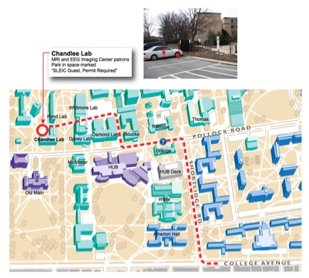

[Parent First Name],

Thank you for agreeing to participate in our study. You are scheduled to have [Child Name] participate in an [EEG] visit on [Day of week] [Date (MM/DD/YYYY)] at [insert time HH:MM am/pm] in room [120] Chandlee Laboratory at Penn State.  
Directions to the SLEIC are located below.

Here is some important contact information for you:

120 Chandlee Laboratory: 814-867-2968  
Andrea Seisler: 814-933-9201

Please let me know if you have any questions. I look forward to seeing you.

Thank you,  
Andrea 
Lab Manager
Brain Development Laboratory

Directions to SLEIC  

Chandlee Laboratory is located in the middle of campus across from Old Main. See the maps below for location and parking information. Chandlee Laboratory is located in a traffic restricted area. Tell the staff person at the booth that you are participating in an experiment (MRI or EEG) at the Imaging Center.  

The parking lot behind Chandlee has two spaces available for participant parking. Please park in one of the spaces marked "SLEIC Guest, Permit Required". A member of our research team will give you a parking permit when you arrive.  

University Park Campus Map  

Chandlee Laboratory Map  
  

Driving Directions Map to Chandlee Laboratory  
  
