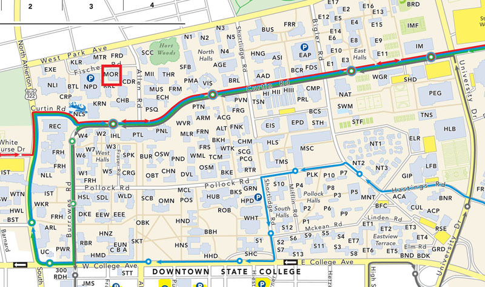
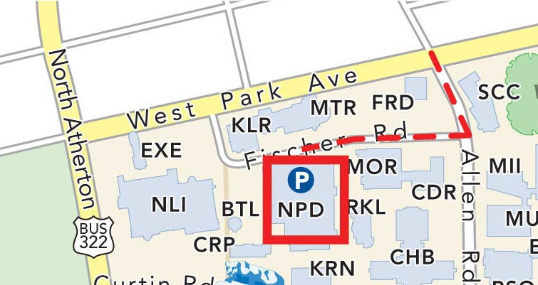
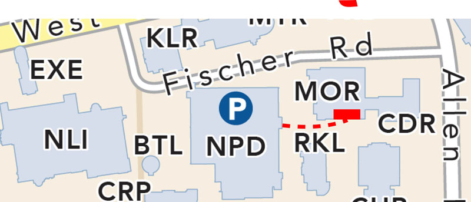

[Parent First Name],

Thank you for agreeing to participate in our study. You are scheduled to have [Child Name] participate in a behavioral visit on [Day of week] [Date (MM/DD/YYYY)] at [insert time HH:MM am/pm] in room 449 Moore Building at Penn State. 

Directions to Moore Building are located below.

Here is some important contact information for you:

449 Moore Building: 814-863-3116  
Andrea Seisler: 814-933-9201

Please let me know if you have any questions. I look forward to seeing you.

Thank you,  
Andrea   
Lab Manager  
Brain Development Laboratory  
Phone: 814-863-3116  

Directions to Moore 

Moore Building is located off of Park Avenue near the Nittany Lion Inn. Please park in the Nittany Parking Deck between Moore Building and the Nittany Lion Inn. Please bring $2 for parking. See the maps below for location and parking information. After parking, please exit the building on the side of Moore building, come to the front of the building. After entering the building walk straight to the second set of elevators.  Take the elevator to the 4th floor.  Make a left after exiting the elevator. Turn right at the next hallway. Room 449 is the 2nd on the right.

University Park Campus Map  

Moore Building Map  

Driving Directions Map to Nittany Parking Deck  

Walk from Nittany Parking Deck to Front of Moore Building

  

