# Post Session Protocol High Density EEG  

## On NetStation Mac  

- Reminder: If you have not done so, save and close Net Station by pressing the **Close Session** button in the upper right hand corner of the NetStation window.  

### Open Session  

- From the Net Station startup screen, go to **File > Open** to access archived sessions.  
  - Session files are usually located in: /Users/GilmoreLab/Documents/NetStation User Data/Sessions

      
  
  - to find the most recent session, click on the **Date** field in the Finder window. The small arrow should face downward to sort files in reverse date order (most recent first)  
  
      

### Run Waveform Tools  

- From the **Tools** menu, open **Waveform Tools**  

      

- Run the Conatenate tool  
  - Press the **Add** button, and add the session file you wish to the Inputs window  
  - Select the **Concatenate Epochs for PowerDiva** tool from Specifications window  
    - To monitor progress, press the **Jobs/Results** button    
    - To run the tool, press the **Run** button  
    
    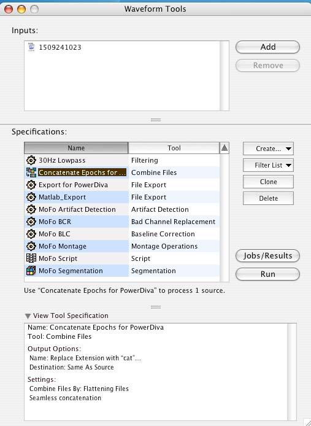  

- Run the Export to Power Diva tool  

    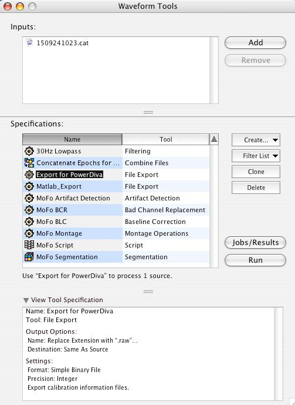  

  - Add the **.cat** file you just created to the Inputs window by pressing the **Add** button  
  - Select the **Export for PowerDiva** tool from Specifications window   
    - To monitor progress, press the **Jobs/Results** button    
    - To run the tool, press the **Run** button  
      - This can take 3-8 minutes.  

- Quit Net Station  

- Quit the PowerDiva Video application on the PDvideo computer if you have not already done so.  

### Transfer data for analyses  

#### Transfer to PDVideo (currently not used)
- On the NetStation computer desktop, double-click the **NetStation_Sessions@PDVideo alias** (highlighted in green)

    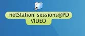  

- Create a new folder with the participant ID (e.g. YYMMDDXXXX - test date (year, month, day) 4 digit participant ID #  
- Double click on **Sessions@Local** (highlighted in red). This opens a separate window to the local NetSataion Sessions folder.

    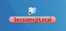    

- Select the files for copy to the PDVideo machine (via the green folder)  
  -  Copy the following:  
    -  **original session file**  
    -  **raw data file** (.raw)  
    -  **cat data file** (.cat)  
    -  **gains file** (.GAIN)  
    -  **zero file** (.ZERO)  
    -  **impedance file** (.IMP)  
  - **Shift** or **command+Click** on these files and drag them to the green Net Station folder.  
    - This can take 5-10 minutes.  

    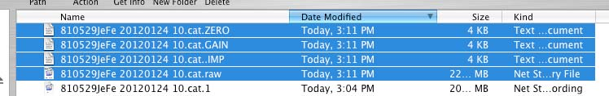   - Take New Picture  

- On the PDvideo computer make a copy (**file > duplicate**) (Command + d) of the stimulus set (found in **stimulus set** folder on the desktop) and put this in the participant's folder within the NetStations session folder.

Take new picture of files copying.  

- Once copied, shut down the NetStation computer  

#### Transfer to Data Transfer USB drive 
- Insert the USB device into the USB port above the NetStation computer
- Open USB drive folder
- Create a new folder with the participant ID (e.g. YYMMDDXXXX - test date (year, month, day) 4 digit participant ID #  

- Select the files for copy to the PDVideo machine (via the green folder)  
  -  Copy the following:  
    -  **original session file**  
    -  **raw data file** (.raw)  
    -  **cat data file** (.cat)  
    -  **gains file** (.GAIN)  
    -  **zero file** (.ZERO)  
    -  **impedance file** (.IMP)  
  - **Shift** or **command+Click** on these files and drag them to the green Net Station folder.  
    - This can take 5-10 minutes.  

   - Take New Picture  
 

- Once copied, shut down the NetStation computer 

 

## Bring USB Drive to 449 Chandlee
   
   

## On Power Diva Laptop  

- Insert the USB drive into the laptop
- Copy the participant folder from the USB drive to: GilmorePB12_HD > Applications (MacOS9) > eeg-data
- Copy the appropriate stimulus set from GilmorePB12_HD > Applications (MacOS9) > eeg-data > Stimulus_Sets_20150428 to the appropriate folder

### Open Power Diva
- Open the Power Diva Host 3.4 application by double clicking the icon on the desktop  

     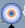  
     
- Ignore error messages and choose to work offline.  
  
### Import NS Session  

  - Import NS Session by choosing **File > Import NS Session**  
      
    - Choose the file from the **NetStation_sessions** folder on the desktop. 
    
       

- Session window: Enter operator and participant information   
  - Operator: Complete First and Last Name  
  - Participant  
    - First Name = blank  
    - Last name = participant ID Code (e.g. yymmddXXXX)  
    - Birthday and Due Date = Birthday  
  - Net Station Recording  
    - Raw EEGs: Click **choose** then select the .raw file in the NetStation_sessions folder you just copied the files to.   
    
     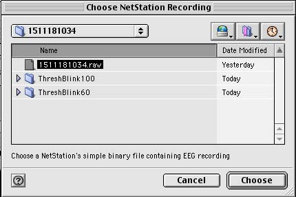  

    - Zeros/Gains: Click **choose** then **shift-click** on both the .ZERO and .GAIN files within the participant's session folder.  
    
     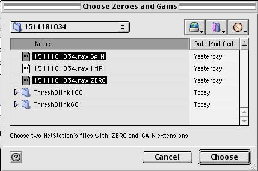  
     
    
  - Stimuli  
    - Stim Set/Ssn: Click **choose** then navigate to the duplicate file within the participant's session folder.  
        
    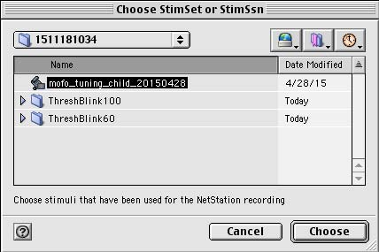  

  - If loaded correctly you should see valid data appear in the Video System, Display Type and Video Mode fields. 

  - Click **OK** to import the data into Power Diva Host. 
  
### Checking for Artifacts  

  - Power Diva will automatically check for artifacts, after which you may change the rejection threshold.
  
      

  - Change Raw Thresh Detector  
    - Adults = 50  
    - Children = 60 (Low Density), 100 (High Density) 
    - Infants = 200
  - Click **Repeat Detection** 
  - Note the channel numbers above threshold on the corresponding Session Information File.
  - Place the channels above threshold for channels 50-100 into the google document with participant data.
  - Click **OK** to continue  
  
    

### Analysis Parameters  

- Set **Processing Task**-harmonics of interest for analysis
  - This is usually set up beforehand, but be sure to select all multiples of F1 (1F1, 2F1, 3F1, 4F1, 5F1, 6F1, 7F1, 8F1, 9F1). Then select 1F2, 1F1 + 1F2, and 1F1 - 1F2
  - Click **Set To All** above the title 'Processing Task'
- Set **Epoch Rejection Parameters** 
  - Change Raw Threshold Detector (adults 50, **children 60**, **infants 200**)
  - Change Blink Threshold (adults, children = 60, **infants = 200**)
  - Click **Set To All** above the title 'Epoch Rejection Parameters'
- Click **Continue** to view the imported PD session
  - This takes ~10 minutes to run  
  
    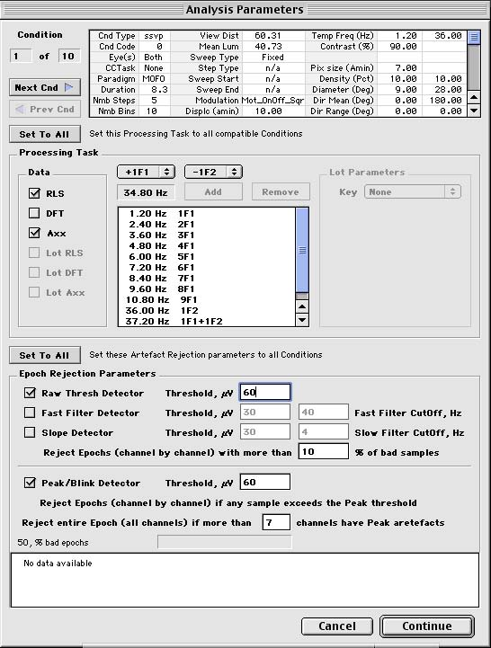   

### Export MATLAB data  

- Go to **File > Export**  
- Export Window  
  - Export as: Matlab Files
  - Matlab Options  
    - Under **Axx Filter**, change P-thresh to **0.05**
  - Data Types  
    - Check the box for **Axx**
  - Click **Export**
  - When exported, click **Done**
  
    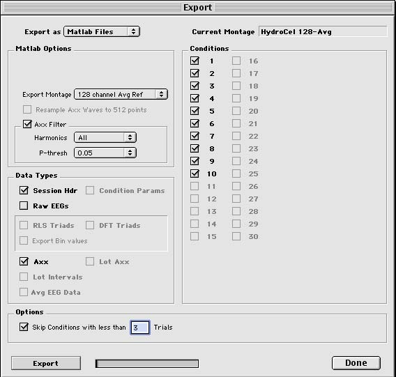   
  
- Close the session
  - Click the **Close** button next to the Session window
  
     

### Export RLS data  

- Go to **R&D > Batch Export ODBC...**  

    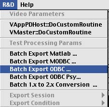 

- A window will open concerning bins  
  - **Export No Bins**  
  - sweeps = **Export Bins**  
   
   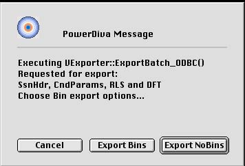 

- Window **Choose Source Folder**  
  - Navigate to the desktop and double click on the Power Diva alias folder
  - Highlight the session of choice
  - Press **Choose**  
  
   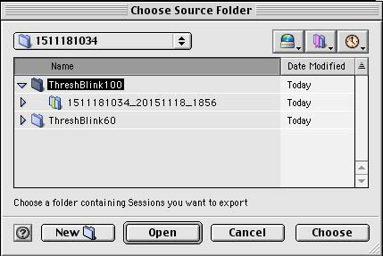  

- Window **Choose Export Folder**  
  - Navigate to GilmorePB12_HD > Applications (MacOS9) > eeg-data > participant IDcode folder
  - Highlight this folder and press the **Choose** button.  
  
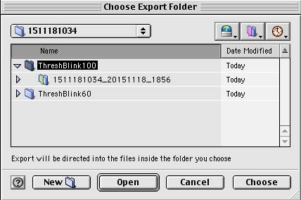  

### Compress and Save Files  

- Within the participant ID folder, highlight the files below by holding down the apple key and left clicking each file until all of the needed files are highlighted
  -  ThreshBlink100  
    - Matlab export folder (YYMMDDXXXX_YYMMDD_HHMM)
      - .pdh file  
      - Data_mtg0 folder 
      - Data folder
      - Exp_MATL_HCN_128_Avg folder
    - CndParams file  
    - QETXT file  
    - RLS.txt file
    - SCHEMA.INI file  
    - SSNHeader.txt file 
  - *Stimulus_Set_* Copy   
- Compress by dragging to the **Dropstuff** icon on the desktop  
- The file Archive.sit will be generated and located in the same folder as the above files.

### Transfer Data from PowerBook G4 to folder on Box Sync

 
- Turn off the PowerBook G4 
- Connect both Mac's to each other using a Firewire cable
- Push the power button on the PowerBook G4 while holding down the ‘T’ key. Let go of the power button normally, but keep holding down the 'T' key until you see a Firewire or Thunderbolt icon displayed on screen
- In a few moments, Powerbook G4's hard drive should appear on the host Mac’s desktop as 'GilmorePB12_HD', allowing you to access it like any other external drive
-  When you are finished, safely eject the target Mac as if it’s any other disk
 
### Archive Files
- Copy participant folder containing the files below to the Participant's folder on the external drive (Gilmore-700GB):
  - Archive.sit
    - ThreshblinkXX folder  
      - Matlab Export folder (participantID_TestDate_time)
        - .pdh file  
        - Data_mtg0 folder 
        - Data folder
        - Exp_MATL_HCN_128_Avg folder
      - *Stimulus_Set_* Copy 
      -  RLS.txt file  
      -  CndParams file  
      -  QETXT file  
      -  SCHEMA.INI file  
      -  SSNHeader.txt file 
  -  **original Net Station session file**  
  -  **Net Station raw data file** (.raw)  
  -  **Net Station cat data file** (.cat)  
  -  **Net Station gains file** (.GAIN)  
  -  **Net Station zero file** (.ZERO)  
  -  **Net Station impedance file** (.IMP) 

  

 
  

