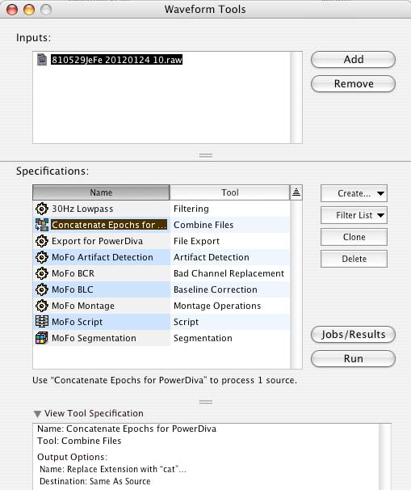

# Post Session Protocol High Density EEG  

## On NetStation Mac  

- Reminder: If you have not done so, save and close Net Station by pressing the **Close Session** button in the upper right hand corner of the NetStation window.  

### Open Session  

- From the Net Station startup screen, go to **File > Open** to access archived sessions.  
  - Session files are usually located in: /Users/GilmoreLab/Documents/NetStation User Data/Sessions

    
  
  - to find the most recent session, click on the **Date** field in the Finder window. The small arrow should face downward to sort files in reverse date order (most recent first)  
  
    

### Run Waveform Tools  

- From the **Tools** menu, open **Waveform Tools**  

  

- Run the Conatenate tool  
  - Press the **Add** button, and add the session file you wish to the Inputs window  
  - Select the **Concatenate Epochs for PowerDiva** tool from Specifications window  
    - To monitor progress, press the **Jobs/Results** button    
    - To run the tool, press the **Run** button  
    
  

- Run the Export to Power Diva tool  

  

  - Add the **.cat** file you just created to the Inputs window by pressing the **Add** button  
  - Select the **Export for PowerDiva** tool from Specifications window   
    - To monitor progress, press the **Jobs/Results** button    
    - To run the tool, press the **Run** button  
      - This can take 3-8 minutes.  

- Quit Net Station  

- Quit the PowerDiva Video application on the PDvideo computer if you have not already done so.  

### Transfer data for analyses  

#### Transfer to PDVideo
- On the NetStation computer desktop, double-click the **NetStation_Sessions@PDVideo alias** (highlighted in green)

  

- Create a new folder with the participant ID (e.g. YYMMDDXXXX - test date (year, month, day) 4 digit participant ID #  
- Double click on **Sessions@Local** (highlighted in red). This opens a separate window to the local NetSataion Sessions folder.

    

- Select the files for copy to the PDVideo machine (via the green folder)  
  -  Copy the following:  
    -  **original session file**  
    -  **raw data file** (.raw)  
    -  **cat data file** (.cat)  
    -  **gains file** (.GAIN)  
    -  **zero file** (.ZERO)  
    -  **impedance file** (.IMP)  
  - **Shift** or **command+Click** on these files and drag them to the green Net Station folder.  
    - This can take 5-10 minutes.  

   - Take New Picture  

Take new picture of files copying.  

- Once copied, shut own the NetStation computer  

## On PowerDiva Computer  

### Duplicate Stimulus Set  

- On the PDvideo computer make a copy (**file > duplicate**) (Command + d) of the stimulus set (found in **stimulus set** folder on the desktop) and put this in the participant's folder within the NetStations session folder.

  

### Open Power Diva  

- Open the Power Diva Host 3.4 application by double clicking the icon on the desktop  

  

  - Ignore error messages and choose to work offline.  
  
### Import NS Session  

  - Import NS Session by choosing **File > Import NS Session**  
    - Choose the file from the **NetStation_sessions** folder on the desktop. 
    
      

- Session window: Enter operator and participant information   
  - Operator: Complete First and Last Name  
  - Participant  
    - First Name = blank  
    - Last name = participant ID Code (e.g. yymmddXXXX)  
    - Birthday and Due Date = Birthday  
  - Net Station Recording  
    - Raw EEGs: Click **choose** then select the .raw file in the NetStation_sessions folder you just copied the files to.   
    
     

    - Zeros/Gains: Click **choose** then **shift-click** on both the .ZERO and .GAIN files within the participant's session folder.  
  - Stimuli  
    - Stim Set/Ssn: Click **choose** then navigate to the duplicate file within the participant's session folder.  

  - If loaded correctly you should see valid data appear in the Video System, Display Type and Video Mode fields. 

   

  - Click **OK** to import the data into Power Diva Host. 
  
### Checking for Artifacts  

  - Power Diva will automatically check for artifacts, after which you may change the rejection threshold.
  
   

  - Change rejection threshold  
    - Adults = 50  
    - Children = 60  
  - Click **Repeat Detection**  
  - Click **OK** to continue  
  
     

### Analysis Parameters  

- Set **Processing Task**-harmonics of interest for analysis
  - This is usually set up beforehand, but be sure to select all multiples of F1 (1F1, 2F1, 3F1, 4F1, 5F1, 6F1, 7F1, 8F1, 9F1). Then select 1F2, 1F1 + 1F2, and 1F1 - 1F2
  - Click **Set To All** above the title 'Processing Task'
- Set **Epoch Rejection Parameters** 
  - Change Raw Threshold Detector (adults 50, **children 60**)
  - Click **Set To All** above the title 'Epoch Rejection Parameters'
- Click **Continue** to view the imported PD session
  - This takes ~10 minutes to run  
  
     

### Export MATLAB data  

- Go to **File > Export**  
- Export Window  
  - Export as: Matlab Files
  - Matlab Options  
    - Under **Axx Filter**, change P-thresh to **0.05**
  - Data Types  
    - Check the box for **Axx**
  - Click **Export**
  - When exported, click **Done**
  
      
  
- Close the session
  - Click the **Close** button net to the Session window
  
  

### Export RLS data  

- Go to **R&D > Batch Export ODBC...**  
- A window will open concerning bins  
  - **Export No Bins**  
  - sweeps = **Export Bins**  
   
    

- Window **Choose Source Folder**  
  - Navigate to the desktop and double click on the Power Diva alias folder
  - Highlight the session of choice
  - Press **Choose**  
  
     

- Window **Choose Export Folder**  
  - Navigate to the desktop and select an external storage devic (such as a USB)  
  - Double Click on this device  
  - Press the **New Folder** button  
  - Name this folder according the participant id and project name.  
  - Highlight this folder and press the **Choose** button.  
  
  

### Compress and Save Files  

- Duplicate the files below and compress them using **Dropstuff**  
  - .pdh file  
  - Data_mtg0  
  - Data  
  - Exp_MATL_HCN_128_Avg  
  - *Stimulus_Set_*Copy  

- Add the files below to the Participant's folder on the external drive:  
  - .pdh file.sit  
  - Data_mtg0.sit  
  - Data.sit   
  - Exp_MATL_HCN_128_Avg.sit  
  - *Stimulus_Set_*Copy.sit  
  -  **original Net Station session file**  
  -  **Net Station raw data file** (.raw)  
  -  **Net Station cat data file** (.cat)  
  -  **Net Station gains file** (.GAIN)  
  -  **Net Station zero file** (.ZERO)  
  -  **Net Station impedance file** (.IMP) 
  -  RLS.txt file  
  -  CndParams file  
  -  QETXT file  
  -  SCHEMA.INI file  
  -  SSNHeader.txt file  
  
- Remove storage device and load onto computer with Matlab for analysis (separate protocol)  

 
  

