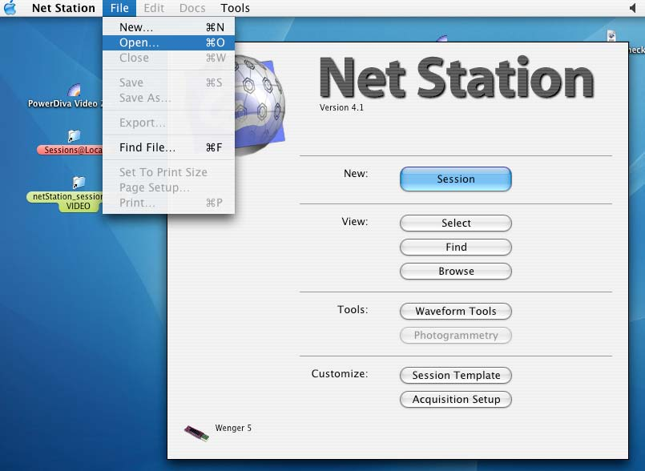
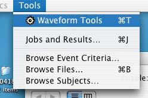
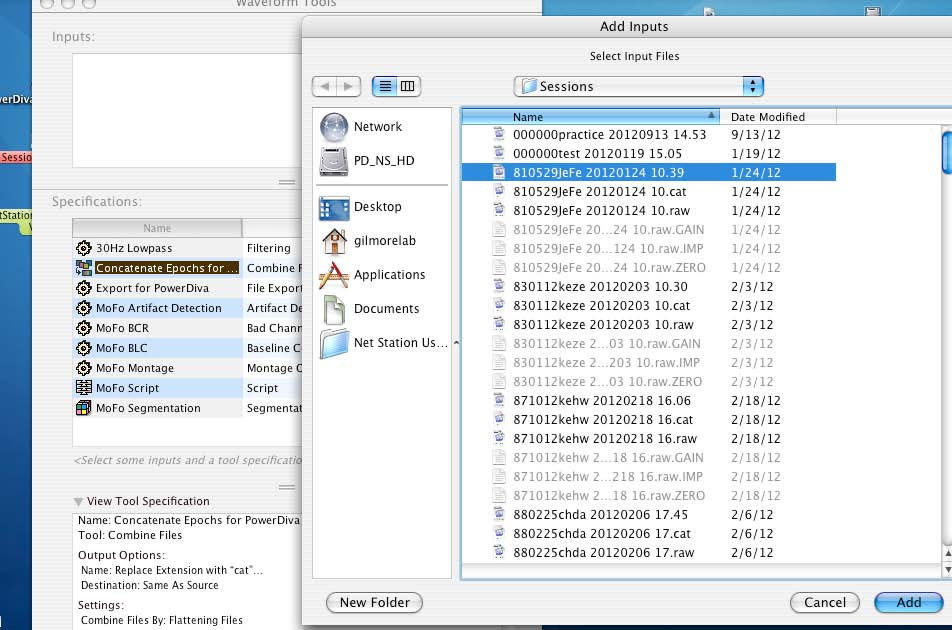
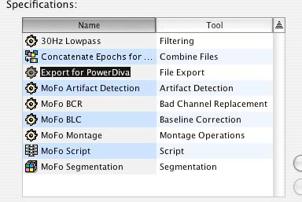

# Post Session Protocol High Density EEG
## On NetStation Mac
- Reminder: If you have not done so, save and close Net Station by pressing the **Close Session** button in the upper right hand corner of the NetStation window.  
- From the Net Station startup screen, go to **File > Open** to access archived sessions.  
  - Session files are usually located in: /Users/GilmoreLab/Documents/NetStation User Data/Sessions

    
  
  - to find the most recent session, click on the **Date** field in the Finder window. The small arrow should face downward to sort files in reverse date order (most recent first)  
  
    

- From the **Tools** menu, open **Waveform Tools**  

  

- Run the Conatenate tool  
  - Press the **Add* button, and add the session file you wish to the Inputs window  
  - Select the **Concatenate Epochs for PowerDiva** tool from Specifications window  
    - To monitor progress, press the **Jobs/Results** button    
    - To run the tool, press the **Run** button  
    
  

- Run the Export to Power Diva tool  

  

  - Add the **.cat** file you just created to the Inputs window by pressing the **Add** button  
  - Select the **Export for PowerDiva** tool from Specifications window   
    - To monitor progress, press the **Jobs/Results** button    
    - To run the tool, press the **Run** button  
      - This can take 3-8 minutes.  

-Quit Net Station

