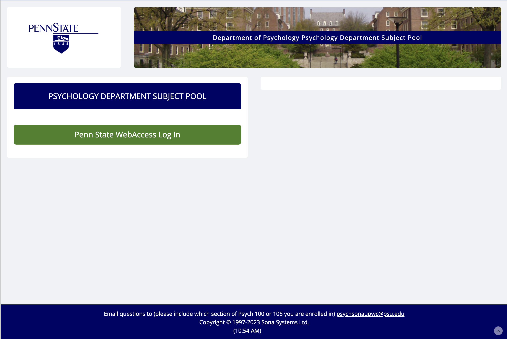
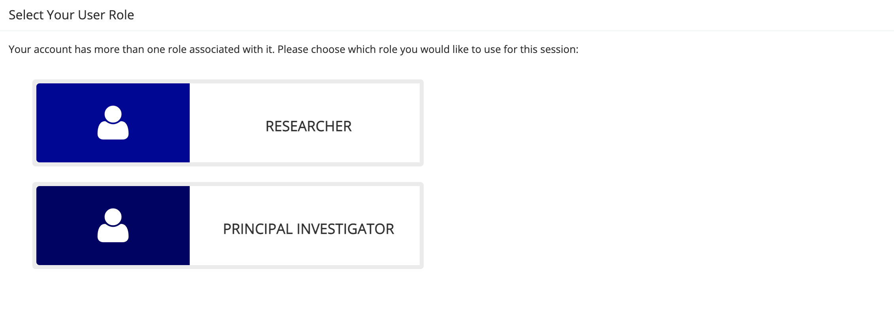
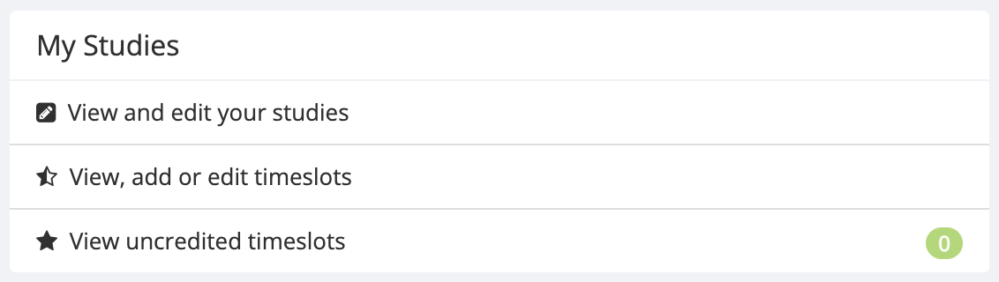
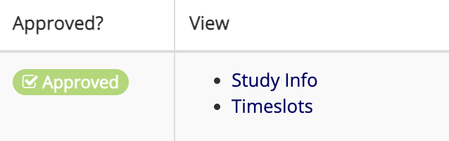
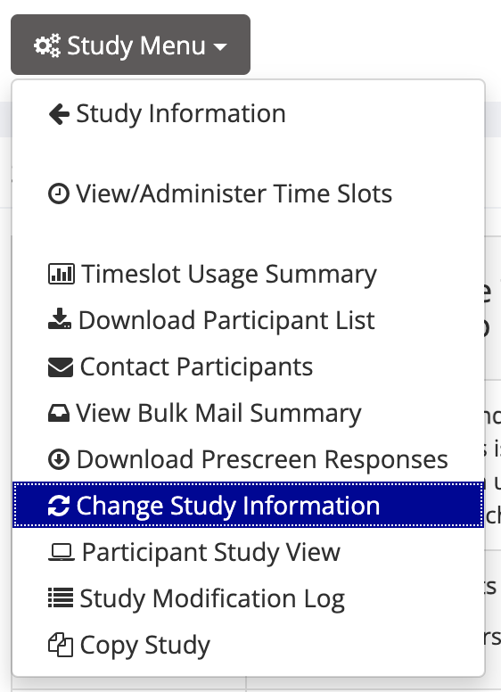
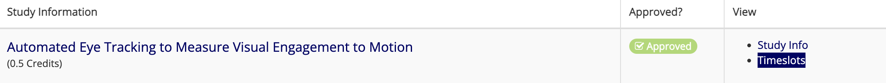
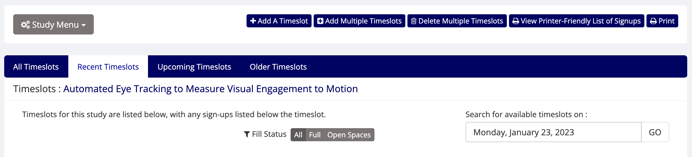

```{r setup, include=FALSE}
knitr::opts_chunk$set(echo = TRUE)
```

# How to Setup a New SONA Study

[SONA](https://pennstate.sona-systems.com/) is the PSU Psychology Department Subject Pool. [Subject Pool Information](https://psych.la.psu.edu/graduate/current-students/psychology-department-subject-pool-information)


## Email the project PI and the graduate student running the study


Dear [Dr. Gilmore],

Please request that [Student Name] and myself be added as a researcher to SONA.

Email: psychsonaupwc@psu.edu
CC: [lab manager][student][any other PI on study]

Dear Subject Pool Administrator,

Please add my lab manager and the graduate student working on my project [Project Name], [IRB#] to the list of available researchers.  Their contact information is as follows:

Andrea Seisler
ars17@psu.edu
Psychology

- [Graduate Student Name]
- [Email address]
- [Department]


Thank you,
Rick Gilmore

---------------

Dear [Graduate Student Name],

Here is a link to the details of the subject pool: https://psych.la.psu.edu/graduate/current-students/psychology-department-subject-pool-information

Please send me the following: 

- most recent IRB approval Form
- current consent form
- current debriefing form. 

I will need to know the following:

- What is the Study Title used in the subject pool advertisement (if different from the IRB title)?
- How many participants should be requested?
- How long should the time slot be (30, 60, or 90 minutes)?
- What is the location of the study?
- What is the Participant Sign-up deadline? e.g. 24, 48 hours?
- What are the Participant inclusion criteria?

I can submit a request for hours once our accounts are activated and I have all of the information above.


Please let me know if you have any questions. 

Kind regards,
Andrea


## Lab Manager add study to SONA

Once the lab manager receives the documentation and answers to all questions above, they create a new study in SONA.

### Log In

Go to: https://pennstate.sona-systems.com/ 

`choose *Penn State Web Access Login* then *Researcher*`

  
  

## How to create a study in SONA


----more here----


## Wait for researcher approval in SONA

The PI (and maybe the lab manager and researcher) will receive a return email when the researchers are added to SONA

## Add researcher to study in SONA

Once the PI, Graduate student and lab manager are added to SONA, the lab manager needs to add the graduate student to the study.

To do this complete the following steps:

 - Lab manager logs into to SONA
 - Select *View and edit your studies*
  

 - Select *Study Info* 
  
  
  - Select *Study Menu* then *Change Study Info*
 


- Scroll down to view the *Researcher* section in *Basic Study Information*
- Select researcher from the box


- Lab manager then emails the student to let them know they have been added to the study in SONA.

## Add timeslots to study in SONA


The researcher adds timeslots for the study

- Log in as Researcher

- Choose *View, add or edit timeslots*
 

- Select *Timeslots*

- On the add timeslots page there are options to add a single timeslot or multiple timeslots


