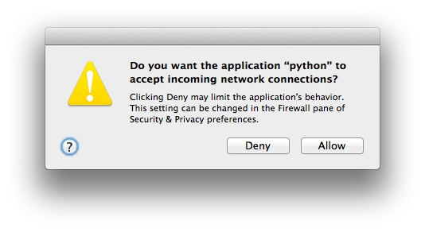
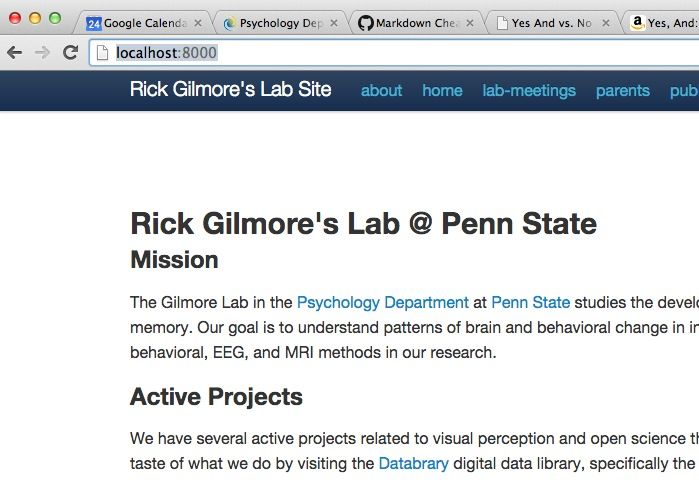

# Gilmore Lab Website Update Procedure

author: Rick O. Gilmore, rick.o.gilmore@gmail.com
date: 2015-04-24

updated: 2016-03-18 by ars

## Background

- Website is hosted using GitHub pages.
- URL is <http://gilmore-lab.github.io>
- Site pages are created using Pelican and Markdown.
- Version control uses git and GitHub.
- The site uses two GitHub repos:
    + <http://github.com/gilmore-lab/gilmore-lab.github.io>
        * Web site HTML, CSS, image and related files
    + <http://github.com/gilmore-lab/gilmore-lab.github.io-src>
        * Markdown and support files

## Editing/updating

- Pull latest changes from GitHub
	+ Open Terminal
    + cd to gilmore-lab.github.io-src/
    + git pull
    + cd to gilmore-lab.github.io/
    + git pull
    
- Edit/add Markdown documents in gilmore-lab.github.io-src/content
    * Most of the static pages are under content/pages
    * Images are under content/images
    * Blog entries under content/blog
- Generate HTML using Pelican
    * Start virtualenv for pelican - this is not needed on Andrea's machine
        - source $PATH-TO-VIRTUAL-ENVS/pelican/bin/activate
        - On Rick's machine this is 
            - *source ~/virtualenvs/pelican/bin/activate*
    * Change to directory with -src code if not already there
        - On Andrea and Rick's machine this is
            + *cd ~/Sites/gilmore-lab.github.io-src*
    * Make HTML - convert .md to .html
        - *make html*
- View HTML locally with browser
    - *make serve*
    - A window opens asking permission to create webserver - this does not show up on Andrea's machine  

- The site may be viewed in a browser by navigating to <http://localhost:8000/>

- When done viewing in the browser, go back to the terminal and push 'control + c' to get back to the prompt.
- Repeat editing/generating/viewing cycle until satisfied.
- Commit changes to GitHub
    + *git status* to view changed files
    + *git add <changed-files>* to add to commit  
    	+ *git add -A* add all changed files to commit  
    + *git commit -m "commit message* to commit  
    	+ *git commit -a -m "commit mesage"* commit all changed files and add message  
    + *git push origin master* to push changes back to GitHub  
- Push changes to "live" site  
    + from gilmore-lab.github.io-src/  
    + *./update_github.sh* runs shell script to make backup, copy site files to the other repo, make git commit, push to GitHub, and open updated site in browser.  